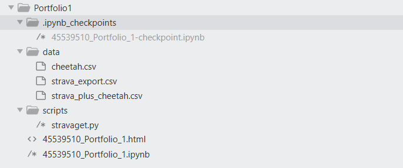
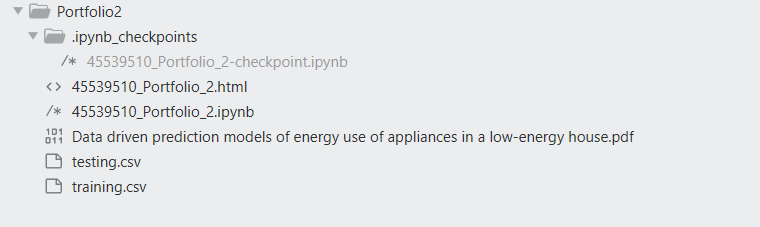
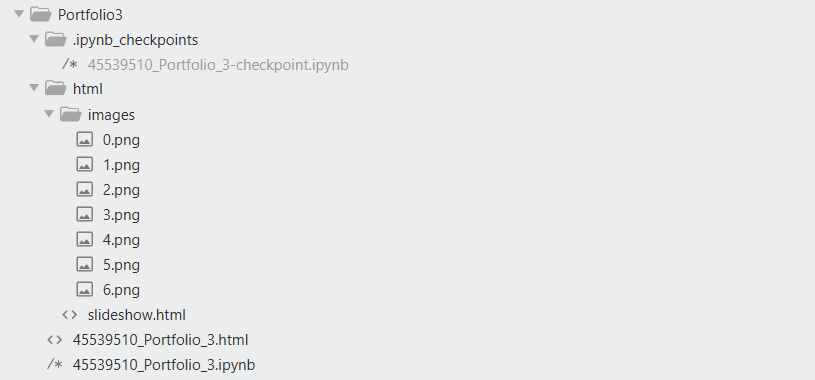

COMP257/ITEC657 Data Science Portfolios 
===
45539510 Nandish Patel
===

## A. Portfolio Project - 1 Explanatory Analysis

### Information

*  Basic operations using pandas - like reading CSV files, modifying their indexes.

*  Merging two dataset using join operations.

*  Removing unnecessary columns.

*  Data cleaning using boolean indexing.

*  Plotting histograms and boxplot to explore distributions of variables using matplotlib.

*  Plotting scatter plot matrix to observe how variables are related to each other using pandas scatter_matrix.

*  Handling time-series data in pandas.

*  Grouping time-series data based on years/months/days.

*  Plotting time-series data to observe any notable patterns in the data.

### File Structure

  *  Directory = .ipynb_checkpoint
	  *  File = 45539510_Portfolio_1-checkpoint.ipynb ⇒ Checkpoint file which is automatically saved by jupyter notebook. Keeping it here for backup purposes.
*  Directory = data
	  *  File = cheetah.csv ⇒  Data in CSV format.
	  *  File = strava_export.csv ⇒  Data in CSV format.
	  *  File = strava_plus_cheetah.csv ⇒  It was created by me because I was unable to run join operation on two csv files.
*  Directory = scripts
	*  File = stravaget.py ⇒ Python script to generate data files.
*  File = 45539510_Portfolio_1.html ⇒ HTML file of Portfolio 1.
*  File = 45539510_Portfolio_1.ipynb ⇒ Portfolio 1 Jupyter notebook.

## B. Portfolio Projects - 2 Reproducing the work done in the paper [Data driven prediction models of energy use of appliances in a low-energy house](https://www.sciencedirect.com/science/article/pii/S0378778816308970?via%3Dihub)

### Information

*  Highlights of the paper
		
	* The appliances energy consumption prediction in a low energy house has been studied.
	* Weather data from a nearby station was found to improve the prediction.
	* Pressure, air temperature and wind speed are important parameters in the prediction.
	* Data from a WSN(Wireless Sensor Network) that measures temperature and humidity increase the pred. accuracy.
	* From the WSN(Wireless Sensor Network), the kitchen, laundry and living room data ranked high in importance.

* Checking the training and testing dataframe splits.
* Plotting various graphs to explore the data.
* After exploring the data, fitting linear model to the data.
* Checking if the author and I got the same results or not.
* Some experimental modelling by creating dummy variables.

###  File Structure

  *  Directory = .ipynb_checkpoint
	  *  File = 45539510_Portfolio_2-checkpoint.ipynb ⇒ Checkpoint file which is automatically saved by jupyter notebook. Keeping it here for backup purposes.
*  File = 45539510_Portfolio_2.html ⇒ HTML file of Portfolio 2.
*  File = 45539510_Portfolio_2.ipynb ⇒ Portfolio 2 Jupyter notebook.
*  File = Data driven prediction models of energy use of appliances in a low-energy house.pdf ⇒ Paper used in Portfolio 2.
*  File = training.csv ⇒ Training data in CSV format.
*  File = testing.csv ⇒ Testing data in CSV format.

## C. Portfolio Projects - 3 How Kmeans Works?

### Information

* The main aim of this Portfolio is to understand how Kmeans algorithm works behind the curtain.

* First step was to create data for clustering. We have used numpy's random function to generate data.

* Then centroids for the data were generated from the data(using mean and standard deviation of the data).

* Euclidean Distance is used as a distance metric.

* Then each iteration of Kmeans was performed in a different cell so that we can understand how cluster assignment and centroid update are happening.

### File Structure

  *  Directory = .ipynb_checkpoint
	  *  File = 45539510_Portfolio_3-checkpoint.ipynb ⇒ Checkpoint file which is automatically saved by jupyter notebook. Keeping it here for backup purposes.
*  Directory = html
	*  Directory = images
		*  Files = 0.png, 1.png, 2.png, 3.png, 4.png, 5.png, 6.png ⇒ Images used to create a slideshow in Portfolio 3 to demonstrate how Kmeans works.
	*  File = slideshow.html ⇒ HTML file to create a slideshow.  
*  File = 45539510_Portfolio_3.html ⇒ HTML file of Portfolio 3.
*  File = 45539510_Portfolio_3.ipynb ⇒ Portfolio 3 Jupyter notebook.

## Remaining File Structure

*  Directory = Readme_images
	  *  Files = Portfolio1.png, Portfolio2.png, Portfolio3.png ⇒ images containing file structure of corresponding Portfolios.
*  Directory = used_functions
	*  Directory = \_\_pycache\_\_
		*  File = custom_functions.cpython-37.pyc ⇒ Cache of compiled file custom_functions.py.
	*  File = custom_functions.py ⇒ Custom functions I have created and used in Portfolios.  
*  File = .gitignore ⇒ It was created to avoid uploading some files.
*  File = Portfolio.html ⇒ All three portfolios in one HTML file.
*  File = Portfolio.ipynb ⇒ All three portfolios in one jupyter notebook.
*  File = README.md ⇒ Descriptions of the this Repository.
*  File = slideshow.html ⇒ To create a slideshow in Portfolio.ipynb 